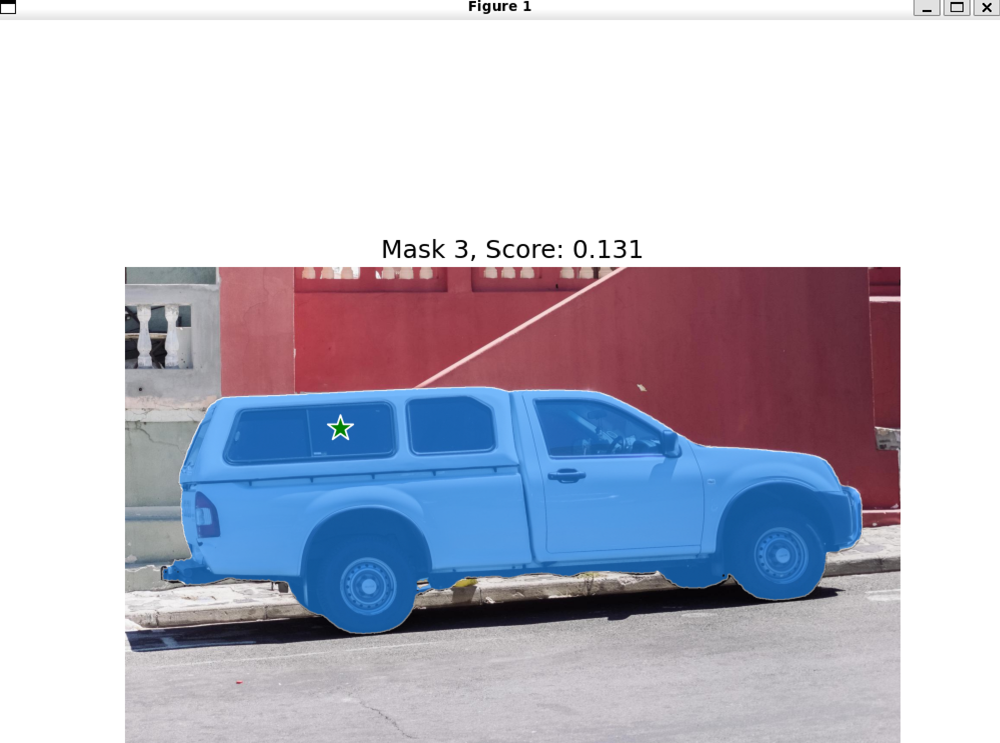
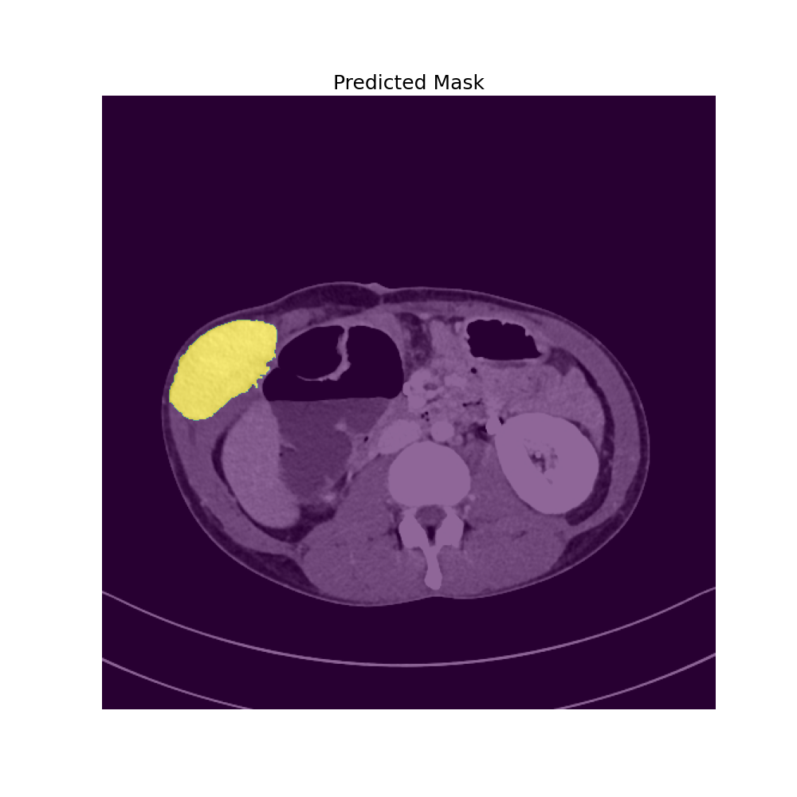

# 👀 Segment Anything 2 + Docker  🐳


Segment Anything 2 in Docker. A simple, easy to use Docker image for Meta's SAM2 with GUI support for displaying figures, images, and masks. Built on top of the SAM2 repo: https://github.com/facebookresearch/segment-anything-2


## Quickstart

This quickstart assumes you have access to an NVIDIA GPU. You should have installed the NVIDIA drivers and CUDA toolkit for your GPU beforehand. Also, make sure to install Docker [here](https://docs.docker.com/engine/install/).

First, let's install the NVIDIA Container Toolkit:

```bash
distribution=$(. /etc/os-release;echo $ID$VERSION_ID) \
   && curl -s -L https://nvidia.github.io/nvidia-docker/gpgkey | sudo apt-key add - \
   && curl -s -L https://nvidia.github.io/nvidia-docker/$distribution/nvidia-docker.list | sudo tee /etc/apt/sources.list.d/nvidia-docker.list
sudo apt-get update
sudo apt-get install -y nvidia-docker2
sudo systemctl restart docker
```

To get the SAM2 Docker image up and running, you can run (for NVIDIA GPUs that support at least CUDA 12.6)

```bash
sudo usermod -aG docker $USER
newgrp docker
docker run -it -v /tmp/.X11-unix:/tmp/.X11-unix  -e DISPLAY=$DISPLAY --gpus all peasant98/sam2:latest bash
```

We have a CUDA 12.1 docker image too, which can be run as follows:

```bash
docker run -it -v /tmp/.X11-unix:/tmp/.X11-unix  -e DISPLAY=$DISPLAY --gpus all peasant98/sam2:cuda-12.1 bash
```

From this shell, you can run SAM2, as well as display plots and images.

## Running the Example

To check SAM2 is working within the container, we have an example in `examples/image_predictor.py` to test the image mask generation. To run:

```bash
# mount this repo, which is assumed to be in the current directory
docker run -it -v /tmp/.X11-unix:/tmp/.X11-unix  -v `pwd`/SAM2-Docker:/home/user/SAM2-Docker -e DISPLAY=$DISPLAY --gpus all peasant98/sam2:cuda-12.1 bash

# in the container!
cd SAM2-Docker/
python3 examples/image_predictor.py

```

## Building and Running Locally

To build and run the Dockerfile:

```bash
docker build -t sam2:latest . 
```

And you can run as:

```bash
docker run -it -v /tmp/.X11-unix:/tmp/.X11-unix  -e DISPLAY=$DISPLAY --gpus all sam2:latest bash
```


Example of running Python code to display masks:




# SAM2 Dockerized Flask Server

This project provides a Flask server running inside a Docker container for using Segment Anything Model 2 (SAM2) to predict masks from images. The server can be accessed via an API and tested with a client script.

## Prerequisites

- **Docker**: Ensure Docker is installed on your machine. You can download it from [here](https://www.docker.com/get-started).
- **GPU Support**: Your machine should support GPUs for faster processing (CUDA enabled).
- **SAM2 Docker Image**: Make sure the Docker image for SAM2 (`sam2:latest`) is built and available locally.

## Run Server

To run the Flask server using Docker, execute the following command:

```bash
docker run -it \
    -v /tmp/.X11-unix:/tmp/.X11-unix \
    -v $(pwd)/../SAM2-Docker:/home/user/SAM2-Docker \
    -e DISPLAY=$DISPLAY \
    --gpus all \
    -p 5000:5000 \
    sam2:latest bash -c "cd /home/user/SAM2-Docker && flask run --host=0.0.0.0 --port=5000"
```

### Explanation:

- `-it`: Runs the container in interactive mode with a pseudo-TTY.
- `-v /tmp/.X11-unix:/tmp/.X11-unix`: Binds the X11 socket to enable graphical output, if needed.
- `-v $(pwd)/../SAM2-Docker:/home/user/SAM2-Docker`: Mounts the SAM2 Docker directory from your host to the container.
- `-e DISPLAY=$DISPLAY`: Passes the display environment variable to the container for graphical applications.
- `--gpus all`: Grants the container access to all available GPUs for accelerated processing.
- `-p 5000:5000`: Maps port `5000` of the container to port `5000` on the host, allowing access to the Flask server via `http://localhost:5000`.
- `sam2:latest`: Specifies the Docker image to use. Ensure that the `sam2:latest` image is built and available.
- `bash -c "cd /home/user/SAM2-Docker && flask run --host=0.0.0.0 --port=5000"`: Executes the command to navigate to the SAM2-Docker directory and start the Flask server, making it accessible on all network interfaces (`0.0.0.0`) at port `5000`.

Once the server is running, it will be accessible at [http://localhost:5000](http://localhost:5000).

## Run Server With docker compose

To run the Flask server using Docker, execute the following command:

```docker compose up --build
```

Server will listen to port 80, change it if needed.

## Test Server

To test the Flask server running inside Docker, use the following command to run the test client script:

```bash
docker run -it \
    -v /tmp/.X11-unix:/tmp/.X11-unix \
    -v $(pwd)/../SAM2-Docker:/home/user/SAM2-Docker \
    -e DISPLAY=$DISPLAY \
    --gpus all \
    --network host \
    -t sam2:latest bash -c "cd /home/user/SAM2-Docker && python3 test_client.py"
```

### Explanation:

- `-it`: Runs the container in interactive mode with a pseudo-TTY.
- `-v /tmp/.X11-unix:/tmp/.X11-unix`: Binds the X11 socket for graphical output, if needed.
- `-v $(pwd)/../SAM2-Docker:/home/user/SAM2-Docker`: Mounts the SAM2 Docker directory from your host to the container.
- `-e DISPLAY=$DISPLAY`: Passes the display environment variable to the container for graphical applications.
- `--gpus all`: Grants the container access to all available GPUs for accelerated processing.
- `--network host`: Shares the host’s networking namespace, allowing the container to communicate with the Flask server running on `localhost`.
- `-t`: Allocates a pseudo-TTY, useful for interactive processes.
- `sam2:latest`: Specifies the Docker image to use. Ensure that the `sam2:latest` image is built and available.
- `bash -c "cd /home/user/SAM2-Docker && python3 test_client.py"`: Executes the command to navigate to the SAM2-Docker directory and run the `test_client.py` script, which sends a request to the Flask server and processes the response.

### Running the Test Client Script

1. **Start the Flask Server**: Ensure the Flask server is running by executing the **Run Server** command above.
2. **Execute the Test Client**: Open a new terminal and run the **Test Server** command to execute the `test_client.py` script inside a Docker container.
3. **View Results**:
   - The test script will display the input image with the specified point marked.
   - It will then send a request to the Flask server to predict the mask.
   - Upon receiving the response, it will display the original image overlaid with the predicted mask.

### Troubleshooting

- **Port Conflicts**: Ensure that port `5000` is not being used by another application on your host machine.
- **GPU Access**: Verify that Docker has access to your GPUs. You can check this by running `docker run --gpus all nvidia/cuda:11.0-base nvidia-smi` to see if the container can access GPU information.
- **Network Issues**: If using `--network host`, ensure that your Docker daemon supports host networking and that there are no firewall rules blocking the connection.

## Additional Information

- **Environment Variables**: If you encounter issues with CuDNN or other CUDA-related optimizations, you might need to set additional environment variables as described in the warnings (e.g., `TORCH_CUDNN_SDPA_ENABLED=1`).
- **Model Configuration**: Ensure that the SAM2 model checkpoint and configuration files are correctly placed in the mounted directory (`/home/user/SAM2-Docker`).
- **Logging**: Check Docker container logs for any runtime errors or warnings to debug issues related to model loading or API requests.

Feel free to customize the Docker commands and scripts to fit your specific use case or environment setup. If you encounter further issues, refer to the SAM2 and Flask documentation for more detailed guidance.

Example of running Python test code to display masks:

